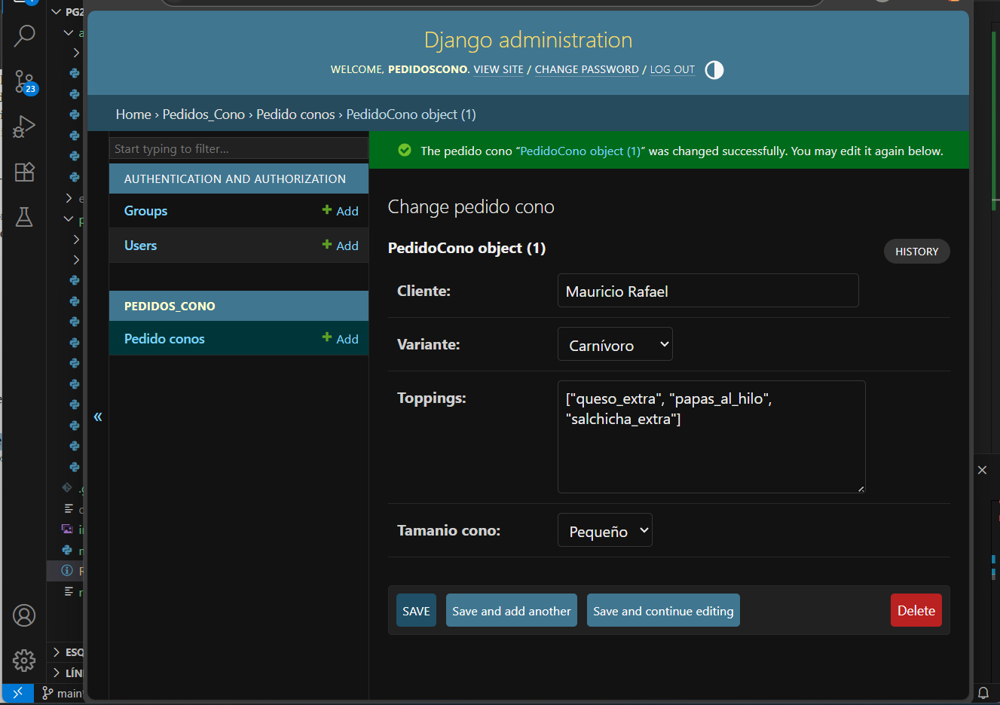
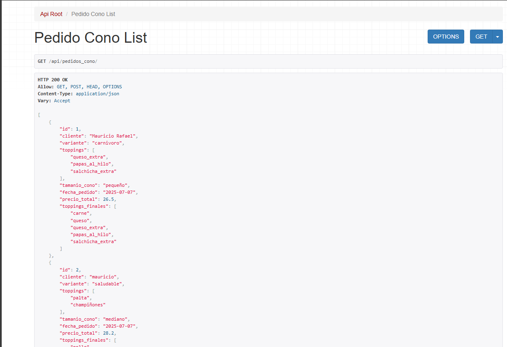
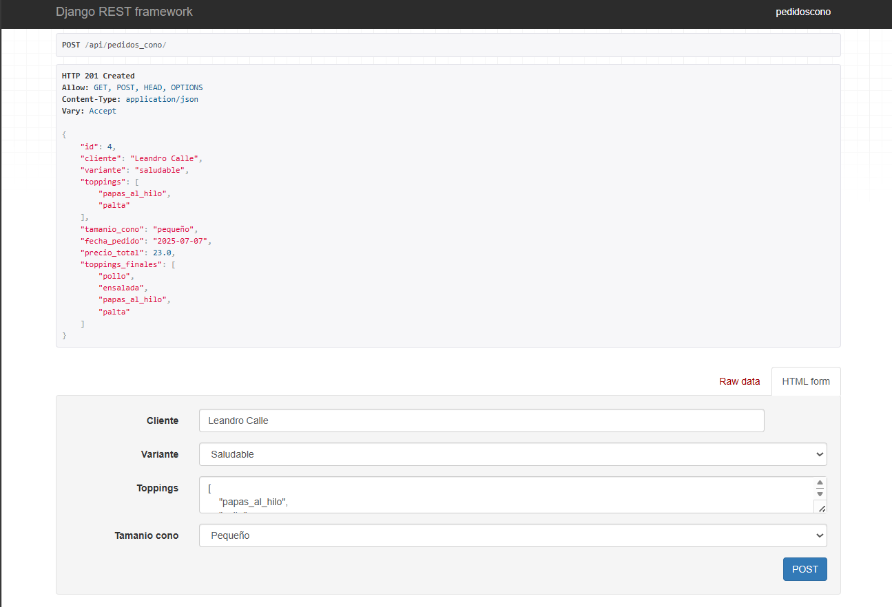
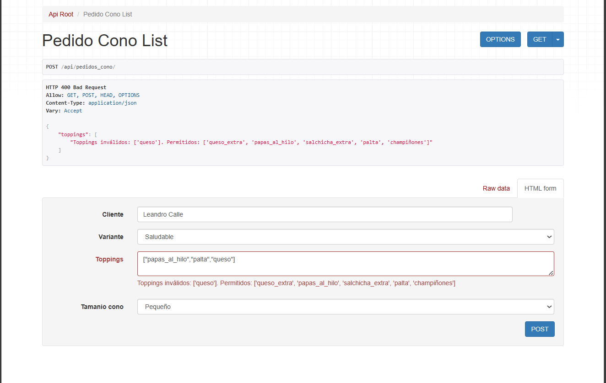

# Pg2_parcial2

* Nombre: Clemente Isla Armando
* Curso : 2°do Año
* Materia: Programacion 2
* Fecha: 07/07/2025

# Describa cómo se aplica cada patrón de diseño en uno de los métodos implementados.

1. Patrón Factory

Clase aplicada: ConoFactory

Código: ConoFactory.obtener_base(obj.variante)

Explicación:
Se usa el patrón Factory para encapsular la creación del tipo de cono base (Carnivoro, Vegetariano o Saludable) sin que el método tenga que conocer directamente la lógica de instanciación. Solo se le pasa el nombre de la variante, y la fábrica devuelve la instancia correcta.

 2. Patrón Builder

Clases aplicadas: ConoPersonalizadoBuilder y ConoDirector

Código:

builder = ConoPersonalizadoBuilder(base)
director = ConoDirector(builder)
director.construir(obj.toppings, obj.tamanio_cono)
Explicación:
Se utiliza el patrón Builder para construir un objeto "complejo" (un cono personalizado con toppings y tamaño ajustado) paso a paso:

ConoPersonalizadoBuilder agrega toppings y calcula el precio.

ConoDirector organiza el orden del proceso de construcción (recibe toppings y tamaño, y los aplica al builder).

3. Patrón Singleton

Clase aplicada: Logger

Código: Logger().registrar(...)

Explicación:
El patrón Singleton asegura que solo exista una única instancia del logger para todo el sistema. Esto permite registrar eventos (como cálculos de precio o toppings) en una lista compartida, accesible desde cualquier parte del código.

# registro de datos en el administrador

## validando los ingredientes

## registrando correctamente los datos en el administrador

## registros en el endpoint de API REST 

## registrar en API REST correctamente

## registrar en API REST validando los datos

